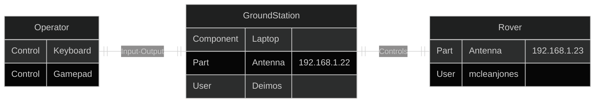
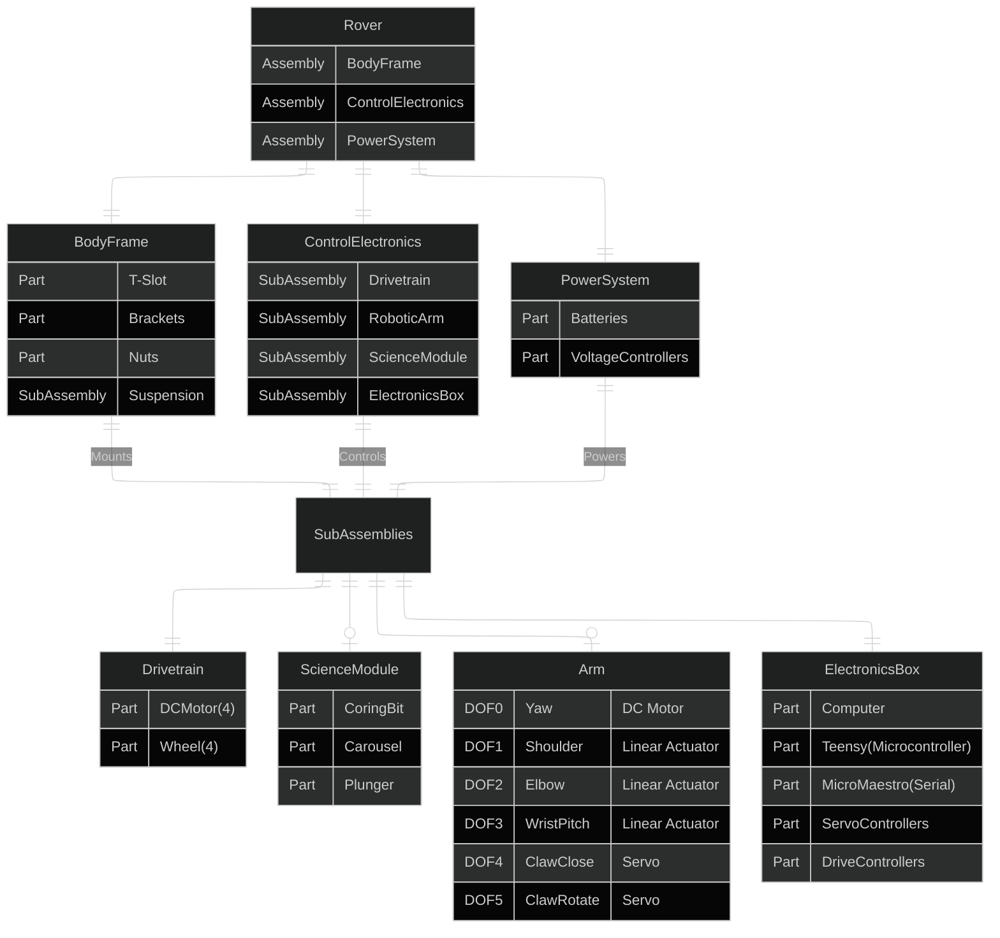

# System Overview
## Control Scheme

```mermaid
---
config:
    theme: dark
---

erDiagram
    direction LR
    Operator ||--|| GroundStation : Input-Output
    GroundStation ||--|| Rover : Controls
    Operator{
        Control Keyboard
        Control Gamepad
    }
    GroundStation{
        Component Laptop
        Part Antenna "192.168.1.22"
        User Deimos
    }
    Rover{
        Part Antenna "192.168.1.23"
        User mcleanjones
    }
```
## Rover Overview

```mermaid
---
config:
    layout: elk
    elk:
        nodePlacementStrategy: NETWORK_SIMPLEX
    theme: dark
---

erDiagram
    Rover{
        Assembly BodyFrame
        Assembly ControlElectronics
        Assembly PowerSystem
    }
    Rover ||--|| BodyFrame : " "
    BodyFrame{
        Part T-Slot
        Part Brackets
        Part Nuts
        SubAssembly Suspension
    }
    Rover ||--|| ControlElectronics: " "
    ControlElectronics{
        SubAssembly Drivetrain
        SubAssembly RoboticArm
        SubAssembly ScienceModule
        SubAssembly ElectronicsBox
    }
    Rover||--|| PowerSystem: " "
    PowerSystem{
        Part Batteries
        Part VoltageControllers
    }
    BodyFrame ||--|| SubAssemblies: "Mounts"
    PowerSystem ||--|| SubAssemblies: "Powers"
    ControlElectronics ||--|| SubAssemblies: "Controls"

    SubAssemblies ||--|| Drivetrain: " "
    SubAssemblies ||--o| ScienceModule: " "
    SubAssemblies ||--o| Arm: " "
    SubAssemblies ||--|| ElectronicsBox: " "

    Drivetrain{
        Part DCMotor(4)
        Part Wheel(4)
    }
    ScienceModule{
        Part CoringBit
        Part Carousel
        Part Plunger
    }
    Arm{
        DOF0 Yaw "DC Motor"
        DOF1 Shoulder "Linear Actuator"
        DOF2 Elbow "Linear Actuator"
        DOF3 WristPitch "Linear Actuator"
        DOF4 ClawClose "Servo"
        DOF5 ClawRotate "Servo"
    }
    ElectronicsBox{
        Part Computer
        Part Teensy(Microcontroller)
        Part MicroMaestro(Serial)
        Part ServoControllers
        Part DriveControllers
    }
```