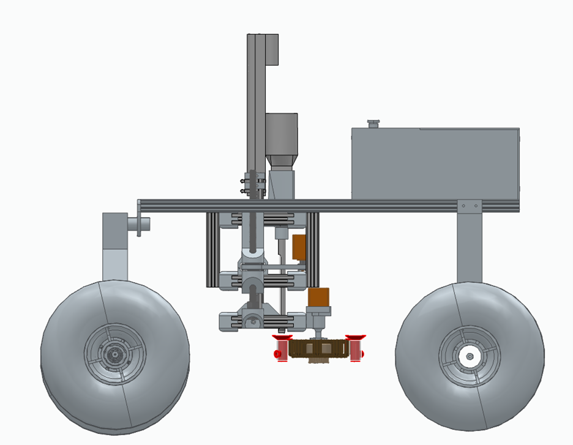
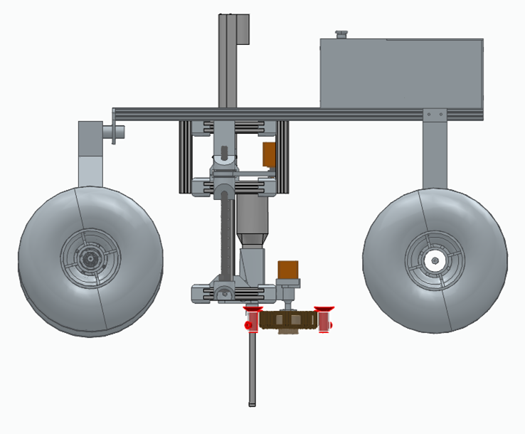

# System Overview

The science module assembly is a completely secondary system, able to be attached and detached from the rover chassis. The science module collects soil samples from the ground and performs life-detecting experiments on board with these samples. The data is collected on the rover and the data is relayed back to the ground station. Figure 5 below shows the science module's complete assembly on the rover.

<figure markdown="span">
    
    <figcaption>Figure 1: Assembled Rover with Fully Stowed Science Module</figcaption>
</figure>

The science module is made up of coring bit that collects the soil and a vial carousel that houses the soil after collection. These vials act as both a dark room to perform one of the two experiments, and a container to hold chemical solutions for the necessary for the sample analysis. The linear actuator and core assembly is mounted below the location that the robotic arm would be mounted. The actuator and sample carousel is raised up from the platform of the chassis to provide ground clearance while driving.

<figure markdown="span">
    
    <figcaption>Figure 2: Assembled Rover with Fully Extended Science Module</figcaption>
</figure>

The vial test tube chain is mounted below the coring drill underneath the chassis platform. All wires to control the science module are run through the front of the electronics housing. An image of the science module assembly on the rover is shown in Figure 3. The linear actuator, coring motor, and carousel all use motors that rely on PWM signals to control them. The vial carousel and Science Module lowering mechanism use stepper motors that use digitally controlled stepper drivers as their control source.

<figure markdown="span">
    
    <figcaption>Figure 3: Assembled Rover with Mounted Science Module</figcaption>
</figure>

## Subsystem Review

The science module consists of four subsystems: **the coring motor, the sample bucket chain**, **the science module lowering platform**, and **the linear actuator**, tied together by a ROS-based control system. This is seen below in Figure 12.

<figure markdown="span">
    
    <figcaption>Figure 12: Science Module Assembly in CAD</figcaption>
</figure>

**The coring motor** consists of a custom coring bit, housed by a 3D-printed mount. We printed the coring bit motor mount as one piece so we could incorporate as much rigidity as possible. The sample containers are not sealed but instead leverage high walls to retain samples in the buckets. Once the coring motor Is loaded with sample, it will be raised over the sample buckets via the **the linear actuator**, is then spun midair to expel samples. By nature, the samples at the bottom of the buckets will consist of the deepest samples collected. The sensors in the sample buckets rest at the bottom for on board analysis.

**The sample bucket chain** houses four sample bucket assemblies that rotate one at a time for sampling each area of interest. The team designed the chain to clip in four test tubes holding two 1" by 0.5" plexiglass vials: one for the hydrogen-peroxide catalase test and one for the ATP luciferase assay. A compact NEMA-17 drives the hub, giving us self-locking position accuracy. This is critical for aligning with the auger spout. A luminometer attached to one of the buckets measures luciferase luminescence while a camera watches the peroxide test tube for O₂ bubbles on the outside.

**the science module lowering platform** is the lower half of the Science module that contains the rotating chain assembly, and the coring bit linear actuator. The lower half is lowered to settle on the soil below the rover in order to position the coring bit as close to the ground as possible. The lowering platform is attached to two linear rails, lowered by two rotating lead screws that are turned via one NEMA-23 stepper motor.

### Performance Review

This section summarizes the performance of the subsystems of the rover. The full detailed report of their performance, including equations, intermediate calculations, and tables with final predicted and actual performance values will be listed in full in Section

### Science Module

During testing, the science module's auger collected soil from a depth of greater than 10 cm with at least 5 g of collected material while mounted on the rover. Figure 19 shows the auger during its soil collection tests.

<figure markdown="span">
    
    <figcaption>Figure 19: Testing Auger Drilling Capabilities</figcaption>
</figure>

Across multiple trials, the auger reached a depth ranging from 12 cm to 15 cm at the highest. The greatest sample mass collected was 10 g in early testing, and further testing reached a higher value of 15 g. Our testing confirmed the auger exceeds the URC's basic constraints for sample collection. We also tested the reaction of hydrogen peroxide with soil samples, and we observed bubbling as we predicted, indicating the presence of catalase.